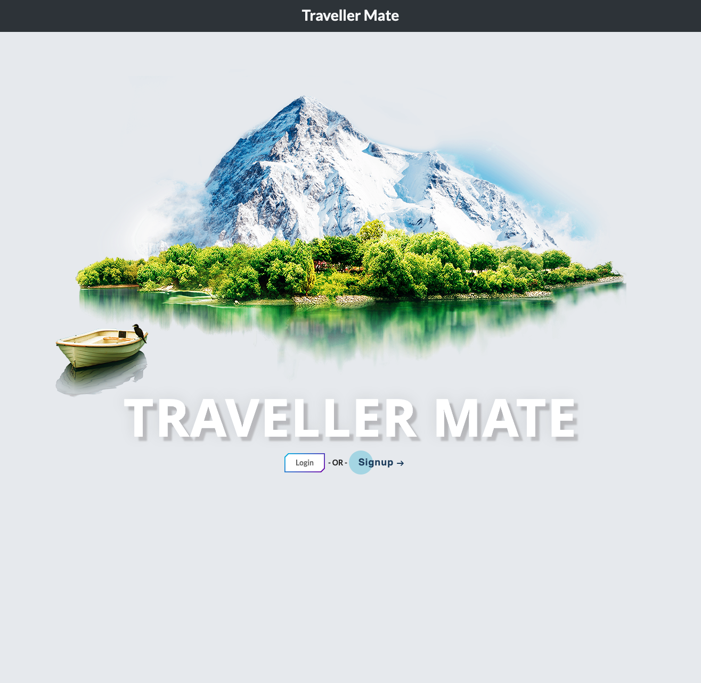

# Traveller Mate

Live URL: ???

# Desciption

This is a full MERN stack application, designed to let users plan ahead of their travels. Once the user created an account, they can then create their own trips with customizable name and description. The user will then be presented with 2 buttons, allowing them to find flights and hotels they can book for their trip. The total will be calculated and the saved flight and hotels can be removed.

The server is build with [Express](https://www.npmjs.com/package/express) and [Apollo](https://www.npmjs.com/package/apollo-server-express), the database is [MongoDB](https://www.npmjs.com/package/mongodb). Finally the from-end is served with [React](https://www.npmjs.com/package/react), along with many npm package.

This app powered by [Amadeus](https://www.npmjs.com/package/amadeus), proving real life information. Unfortunately, the API doesn't return a link where users can book there flight and hotels. Another downside is that they can't return airports from outside the US (They do provide flights internationally, just the API point to search airport doesn't provide international airports). These functionality can be improved with more API.

## Installation

To use this application, it's required to have node.js installed. Which can be found in their [website](https://nodejs.org/en/download/).

Once you have cloned the files and had node.js installed, install the needed packages by:

    npm install

## Usage

To start the application, just type the following into the command line in the base directory

    npm start

The server and the client will run on your local machine. The graphQL playground will be available on http://localhost:3001/graphql while the front end is available on http://localhost:3000/

## Development notes

This is my very first relatively large size react app, so I've greatly underestimated the size of the app. There's a large ammount of props drilling that should be reduced for better workflow. The code also have a lot of un-finished layout and unused values, but I'll have to skip it for now and focusing on optimizing the state usage.
